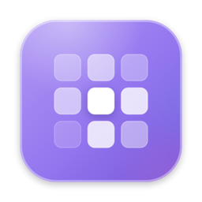
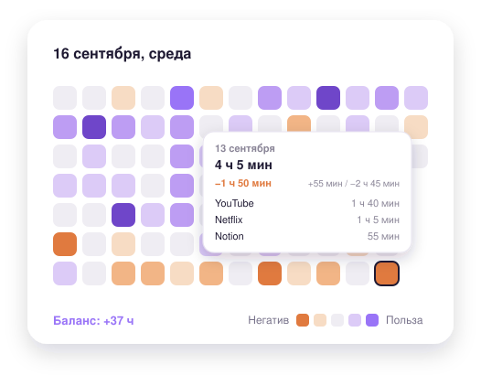

<p align="center">
  
</p>

<h1 align="center">Tile</h1>

<p align="center">
  <b>Маленькая тепловая карта на рабочем столе, которая честно показывает, куда ушло твоё время.</b><br>
  <i>A tiny desktop heatmap that tells you the truth about where your time went.</i>
</p>

<p align="center">
  
  
  
  
</p>

<p align="center">
  <a href="https://github.com/ilya-konoplev/tile/releases/latest/download/Tile.zip"><b>⬇️ Скачать Tile для Mac</b></a>
  &nbsp;·&nbsp;
  <a href="#установка">Как установить</a>
  &nbsp;·&nbsp;
  <a href="#english">English</a>
</p>

<p align="center">
  
</p>

---

<a name="русский"></a>
## Русский

### Что это

Tile — небольшой виджет для macOS, который живёт прямо на рабочем столе и превращает твою повседневную активность за компьютером в сетку цветных плиток — по одной на день, как график контрибуций на GitHub, только вместо коммитов — реальная жизнь.

Ничего не нужно вести руками. Виджет тихо читает те же данные Экранного времени, которые macOS и так собирает, и превращает их в то, на что можно просто взглянуть: сегодня был хороший день или день залипания в ленту? Эта неделя лучше прошлой? Ответ на сетке виден за полсекунды.

### Возможности

- 🟪 **Сетка, которую реально читаешь.** Около трёх месяцев по дням, по плитке на день, каждая окрашена по тому, как прошёл день.
- ✅❌ **Ты сам решаешь, что полезно, а что нет.** Помечаешь приложения и сайты как полезные или вредные. Баланс дня — полезное время минус вредное.
- ⚖️ **Взвешивание под себя.** Можно включить «Всё вредным по умолчанию», чтобы ничего не проскочило неразмеченным, и настроить «вес» вредного времени.
- 👀 **Наведи — увидишь кратко, нажми — раскроется всё.** Наведение показывает топ приложений за день, клик раскрывает полную раскладку.
- 🖱️ **Живёт там, где ты его оставил.** Перетаскивается по рабочему столу, размер меняется ручкой снизу (60–140%), всё запоминается.
- 🎨 **Два оформления.** Обычное или «Жидкое стекло», светлая, тёмная или автоматическая тема.
- ⚙️ **Окно настроек** в стиле системных настроек macOS: цвета, размер, тема, язык и список всех приложений и сайтов с поиском.
- 📋 **Значок в строке меню** — быстрый тумблер и переход в настройки.
- 🌍 **Русский и английский интерфейс.**

### Приватность

Всё считается локально на твоём Маке. У приложения нет сетевого кода — ничего никуда не отправляется. Доступ к диску нужен только затем, что macOS хранит базу Экранного времени в защищённой папке.

---

### Установка

**Что нужно:** Mac на Apple Silicon (M1, M2, M3, M4 и новее) и macOS 13 Ventura или новее.
Мак на Intel? Готовый файл не запустится — используй [сборку из исходников](#сборка-из-исходников).

#### Шаг 1. Распаковать и переложить в «Программы»

1. [Скачай Tile.zip](https://github.com/ilya-konoplev/tile/releases/latest/download/Tile.zip) и дважды кликни по нему в «Загрузках» — появится `ActivityHeatmap.app` (это и есть Tile). Safari часто распаковывает архив сам — тогда приложение уже лежит в «Загрузках».
2. Перетащи `ActivityHeatmap.app` в папку **Программы** (Applications).

#### Шаг 2. Первый запуск

Приложение не проходило платную проверку Apple, поэтому при первом запуске macOS его заблокирует. Это нормально, делается один раз.

1. Открой **Программы** и дважды кликни по `ActivityHeatmap`.
2. Появится окно «Не удаётся открыть…» / «Apple не может проверить…». Нажми **Готово** (не «Переместить в Корзину»).
3. Открой **Системные настройки → Конфиденциальность и безопасность**, пролистай вниз.
4. Там будет строка про `ActivityHeatmap` и кнопка **Всё равно открыть** (Open Anyway). Нажми её, подтверди паролем или Touch ID и ещё раз нажми **Открыть**.

> На macOS 13–14 можно проще: правый клик по приложению → **Открыть** → **Открыть**.

После запуска в Dock ничего не появится — это нормально. Tile живёт **значком в строке меню** (вверху справа), а на рабочем столе появится карточка с просьбой дать доступ.

#### Шаг 3. Дать доступ к данным Экранного времени

1. **Системные настройки → Конфиденциальность и безопасность → Полный доступ к диску.**
   (Или значок Tile в строке меню → «Настройки…» → кнопка «Открыть настройки системы».)
2. Нажми **«+»** внизу списка, выбери **Программы → ActivityHeatmap**, нажми «Открыть».
3. Включи переключатель напротив `ActivityHeatmap`.
4. **Перезапусти Tile:** значок в строке меню → «Выход», затем снова открой его из «Программ».
   Без перезапуска приложение не увидит новое разрешение.

Готово — на рабочем столе появится сетка. Tile сразу подтянет то, что macOS успела сохранить за последние дни, а дальше сетка будет заполняться сама, день за днём.

#### Шаг 4 (по желанию). Настроить под себя

- **Запускать при входе:** значок в строке меню → «Настройки…» → «Запускать при входе».
- **Разметить приложения:** там же, «Приложения и сайты» — отметь, что полезно, а что вредно. Сразу после этого плитки начнут краситься по балансу дня.
- **Передвинуть виджет:** потяни за шапку карточки. **Размер** — ручка внизу.

### Если что-то не так

| Проблема | Что сделать |
|---|---|
| Виджет пишет, что нужен доступ, хотя доступ выдан | Выйди из Tile через строку меню и открой заново. Проверь, что переключатель в «Полном доступе к диску» включён именно у `ActivityHeatmap` из «Программ». |
| Нет кнопки «Всё равно открыть» | Сначала попробуй открыть приложение двойным кликом — кнопка появляется только после этой попытки, примерно на час. |
| Сетка пустая или почти пустая | В первые дни это нормально: история копится со временем. Если пусто и через день — проверь, что включено **Системные настройки → Экранное время**. |
| Виджет не реагирует на мышь | Закрой Übersicht или другие программы для виджетов на рабочем столе — они перехватывают мышь. |
| Не видно значка в строке меню | Он мог спрятаться за «чёлкой» экрана или другими значками. Освободи место в строке меню или временно закрой лишние программы. |

### Удаление

1. Значок в строке меню → «Настройки…» → **выключи «Запускать при входе»**, если он был включён.
2. Значок в строке меню → «Выход».
3. Перетащи `ActivityHeatmap` из «Программ» в Корзину.
4. Если история больше не нужна — удали папку `~/Library/Application Support/ActivityHeatmap`
   (в Finder: меню «Переход» → «Переход к папке…», вставь путь).
5. В «Полном доступе к диску» выдели `ActivityHeatmap` и нажми «−».

### Сборка из исходников

Для Маков на Intel или если хочется собрать самому. Нужен Терминал, займёт минут 10–15.

1. Установи инструменты разработчика (полный Xcode не нужен):
   ```bash
   xcode-select --install
   ```
2. Скачай проект (на GitHub: зелёная кнопка **Code → Download ZIP**) и распакуй.
3. В Терминале перейди в папку `native` внутри проекта (можно набрать `cd ` и перетащить папку в окно Терминала) и собери:
   ```bash
   bash build.sh release
   ```
4. Рядом появится `ActivityHeatmap.app`. Перетащи его в «Программы» и продолжай с [Шага 3](#шаг-3-дать-доступ-к-данным-экранного-времени). Блокировки из Шага 2 при своей сборке не будет.

> Если собираешься пересобирать приложение, сначала создай сертификат по инструкции из `./make_cert.sh` — иначе доступ к диску будет слетать после каждой пересборки. Подробнее — в [native/README.md](native/README.md).

### Статус

Это личный проект, который каждый день используется на одном Маке, а не отполированный массовый продукт. Он зависит от базы Экранного времени, которую ведёт сама macOS, поэтому обновления системы могут что-то сломать. Возможны шероховатости.

---

<a name="english"></a>
## English

### What it is

Tile is a small macOS widget that lives on your desktop and turns your day-to-day computer usage into a grid of colored squares — one per day, like a GitHub contribution graph, except it's about you, not commits.

Nothing to track by hand. It reads the Screen Time data macOS already collects and answers at a glance: was today a good day or a doom-scrolling day? Was this week better than the last?

### Features

- 🟪 **A grid you actually read** — about three months, one square per day.
- ✅❌ **You decide what's useful and what's harmful.** A day's balance is useful time minus harmful time.
- ⚖️ **Your own weighting** — "Harmful by default" and an adjustable weight for harmful time.
- 👀 **Hover for a peek, click for the full breakdown** of every app and site that day.
- 🖱️ **Drag it anywhere, resize it (60–140%)** — it remembers.
- 🎨 **Regular or Liquid Glass**, light, dark or auto theme.
- ⚙️ **A settings window** styled like macOS System Settings.
- 📋 **Menu bar icon** with a quick toggle.
- 🌍 **Russian and English interface.**

### Privacy

Everything stays on your Mac. The app has no network code. Full Disk Access is needed only because macOS keeps the Screen Time database in a protected folder.

### Install

**Requirements:** an Apple Silicon Mac (M1 or newer) and macOS 13 Ventura or later. On an Intel Mac, [build from source](#build-from-source).

1. **Unzip and move.** [Download Tile.zip](https://github.com/ilya-konoplev/tile/releases/latest/download/Tile.zip), double-click it (Safari may have unzipped it already) and drag `ActivityHeatmap.app` into **Applications**.
2. **First launch.** The app isn't notarized by Apple, so macOS blocks it once:
   - Double-click it, then press **Done** in the warning (not "Move to Trash").
   - Open **System Settings → Privacy & Security**, scroll down, click **Open Anyway**, confirm, then **Open**.
   - On macOS 13–14 you can instead right-click the app → **Open** → **Open**.

   There's no Dock icon — Tile lives in the **menu bar**.
3. **Grant access.** **System Settings → Privacy & Security → Full Disk Access** → **+** → pick **Applications → ActivityHeatmap** → turn it on. Then **quit Tile from the menu bar and open it again** — it won't see the permission until restarted.

That's it. Tile pulls in whatever macOS still has from the last few days, and the grid keeps filling in from there.

### Troubleshooting

| Problem | Fix |
|---|---|
| Still asks for access after granting it | Quit from the menu bar and reopen. Make sure the toggle is on for the copy in Applications. |
| No "Open Anyway" button | Try to open the app first — the button only appears after a blocked attempt, for about an hour. |
| Grid is empty | Normal for the first days. If still empty after a day, check that **System Settings → Screen Time** is on. |
| Widget ignores the mouse | Quit Übersicht or other desktop widget managers — they intercept mouse events. |

### Uninstall

Turn off "Launch at login" in settings, quit from the menu bar, move the app to the Trash, optionally delete `~/Library/Application Support/ActivityHeatmap`, and remove the app from Full Disk Access with "−".

### Build from source

```bash
xcode-select --install     # Command Line Tools, not full Xcode
cd native
bash build.sh release
```

Move the resulting `ActivityHeatmap.app` to Applications and continue from step 3. If you plan to rebuild often, create a signing certificate first (`./make_cert.sh` prints the steps), otherwise Full Disk Access resets after every rebuild. Details: [native/README.md](native/README.md).

---

## Для разработчиков / For developers

- [native/](native/) — основное приложение на Swift/SwiftUI: [README](native/README.md) · [ARCHITECTURE](native/ARCHITECTURE.md) · [STATUS](native/STATUS.md)
- [ubersicht-prototype/](ubersicht-prototype/) — первая версия, виджет для [Übersicht](https://tracesof.net/uebersicht/) на Python и JSX. От неё не зависит основное приложение; единственная связь — необязательный тест кросс-валидации, который сверяет обе реализации на синтетических данных.
